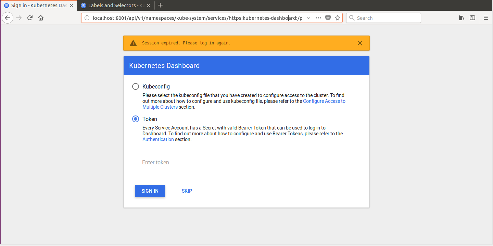
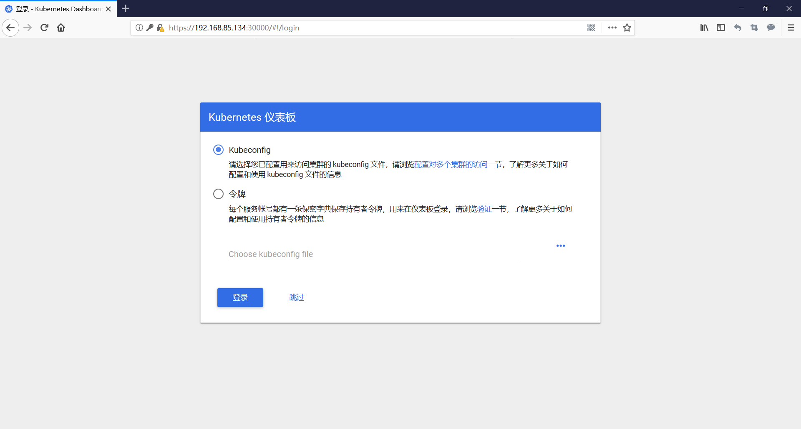
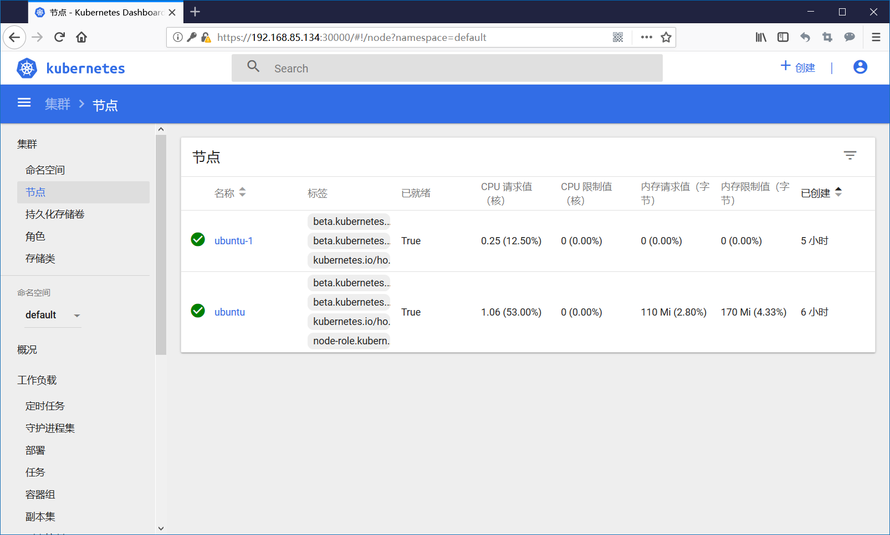
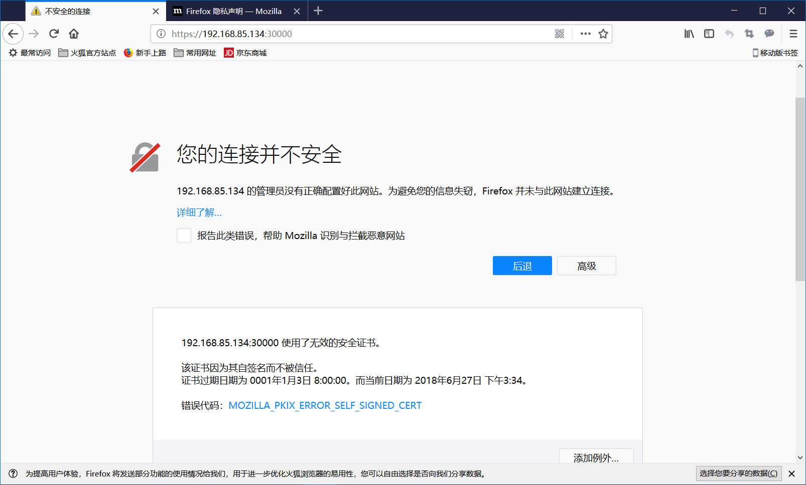

<!-- ‎
    修改时间：2018‎年‎6‎月‎27‎日，‏‎16:07:21
    Author: liluyang
-->

# 在kubernetes集群中安装dashboard插件

## 准备工作

在之前我们已经成功部署了一个简单的Kubernete测试集群，接下来我们要来安装[Dashboard](https://kubernetes.io/docs/tasks/access-application-cluster/web-ui-dashboard/)插件，[Dashboard](https://kubernetes.io/docs/tasks/access-application-cluster/web-ui-dashboard/)是一个基于Web的Kubernetes用户界面。在安装之前呢我们首先要检查一下 Kubernetes 和 Dashboard 的兼容性

|Dashboard \ Kubernetes|1.4|1.5|1.6|1.7|1.8|1.9|
|---|---|---|---|---|---|---|
|1.4|✓|✕|✕|✕|✕|✕|
|1.5|✕|✓|✕|✕|✕|✕|
|1.6|✕|✕|✓|?|✕|✕|
|1.7|✕|✕|?|✓|?|?|
|1.8|✕|✕|✕|✕|✓|✓|
|HEAD|✕|✕|✕|✕|✓|✓|

- `✓` 支持的版本
- `?` 由于突破了Kubernetes API版本之间的变化，某些功能可能无法在 Dashboard（日志，搜索等）中使用。
- `✕` 不支持的版本

官网wiki地址：[Dashboard 和 Kubernetes 的兼容性矩阵](https://github.com/kubernetes/dashboard/wiki/Compatibility-matrix)


## 下载镜像，修改镜像名称

根据上个表格的兼容性可知，我们之前部署的 Kubernetes 版本为1.9.1，所有我们可是使用的 Dashboard 版本为 1.8 以上。执行以下命令下载镜像

``` bash
docker pull liluyang/kubernetes-dashboard-amd64:latest
docker tag liluyang/kubernetes-dashboard-amd64:latest k8s.gcr.io/kubernetes-dashboard-amd64:v1.8.3
docker rmi liluyang/kubernetes-dashboard-amd64:latest
```

## 安装 Dashboard


将文件 [kubernetes-dashboard.yaml](kubernetes-dashboard/kubernetes-dashboard.yaml.txt) 下载到本地，执行以下命令安装 Dashboard

``` bash
# kubectl create -f kubernetes-dashboard.yaml
secret "kubernetes-dashboard-certs" created
serviceaccount "kubernetes-dashboard" created
role.rbac.authorization.k8s.io "kubernetes-dashboard-minimal" created
rolebinding.rbac.authorization.k8s.io "kubernetes-dashboard-minimal" created
deployment.apps "kubernetes-dashboard" created
service "kubernetes-dashboard" created
# kubectl get pod -n kube-system -o wide
NAME                                    READY     STATUS    RESTARTS   AGE       IP               NODE
canal-4n2tw                             3/3       Running   0          2h        192.168.85.134   ubuntu
etcd-ubuntu                             1/1       Running   0          2h        192.168.85.134   ubuntu
kube-apiserver-ubuntu                   1/1       Running   0          2h        192.168.85.134   ubuntu
kube-controller-manager-ubuntu          1/1       Running   0          2h        192.168.85.134   ubuntu
kube-dns-6f4fd4bdf-gpvh4                3/3       Running   0          2h        10.244.0.5       ubuntu
kube-proxy-kbdvk                        1/1       Running   0          2h        192.168.85.134   ubuntu
kube-scheduler-ubuntu                   1/1       Running   0          2h        192.168.85.134   ubuntu
kubernetes-dashboard-5bd6f767c7-cmvb4   1/1       Running   0          8s        10.244.0.6       ubuntu
```
执行成功后可以发现 dashboard 理论上已经安装成功了，接下来我们就需要验证一下

## 访问 dashboard 界面

有多种方式可以访问仪表板 Dashboard UI; 可以使用kubectl命令行代理访问，也可以使用Web浏览器访问Kubernetes主apiserver。

### 命令行代理

您可以通过运行以下命令使用kubectl命令行工具开启代理用来访问仪表板：

``` bash
kubectl proxy
```
Kubectl将处理apiserver的身份验证，并使Dashboard在[http://localhost:8001/api/v1/namespaces/kube-system/services/https:kubernetes-dashboard:/proxy/](http://localhost:8001/api/v1/namespaces/kube-system/services/https:kubernetes-dashboard:/proxy/) 链接中可以访问，如下图所示：



注意：Dashboard UI 只能从执行该命令的机器访问。执行`kubectl proxy --help`可以查看详细的使用方法。

### 直接访问 Master Server

暴露服务的方式可以将 NodePort 映射到物理机的端口号，用于客户端浏览器的访问。在上面的 [kubernetes-dashboard.yaml](kubernetes-dashboard/kubernetes-dashboard.yaml.txt) 文件中，我们已经将 Dashboard 的服务暴露了出来，具体的配置如下：

``` yaml
# ------------------- Dashboard Service ------------------- #
# 暴露服务到物理机端口号，使得服务可以从外部访问

kind: Service
apiVersion: v1
metadata:
  labels:
    k8s-app: kubernetes-dashboard
  name: kubernetes-dashboard
  namespace: kube-system
spec:
  type: NodePort
  ports:
    - port: 443
      targetPort: 8443
      nodePort: 30000
  selector:
    k8s-app: kubernetes-dashboard

```
接下来我们使用[火狐浏览器](http://www.firefox.com.cn/)直接访问就可以了，输入 Master 节点的 IP 地址和对应的 NodePort 端口，例如 [https://192.168.85.134:30000](https://192.168.85.134:30000)，就可以访问我们的 Dashboard 界面了。如下图所示：



注意浏览器地址和 `kube proxy` 方式访问时的地址是不同的。使用暴露服务的访问可以在任何主机上访问 Dashboard，只要满足网络可达的条件即可


## 身份认证

登录dashboard 的时候支持Kubeconfig 和token 两种认证方式，Kubeconfig 中也依赖 token 字段，所以生成 token 这一步是必不可少的。

### 生成 Token
我们创建一个admin用户并授予admin 角色绑定，使用下面的yaml文件创建admin用户并赋予他管理员权限，然后就可以通过token 登陆dashbaord，这种认证方式本质实际上是通过Service Account 的身份认证加上Bearer token请求 API server 的方式实现，参考 Kubernetes 中的认证。

``` bash
kind: ClusterRoleBinding
apiVersion: rbac.authorization.k8s.io/v1beta1
metadata:
  name: admin
  annotations:
    rbac.authorization.kubernetes.io/autoupdate: "true"
roleRef:
  kind: ClusterRole
  name: cluster-admin
  apiGroup: rbac.authorization.k8s.io
subjects:
- kind: ServiceAccount
  name: admin
  namespace: kube-system
---
apiVersion: v1
kind: ServiceAccount
metadata:
  name: admin
  namespace: kube-system
  labels:
    kubernetes.io/cluster-service: "true"
    addonmanager.kubernetes.io/mode: Reconcile
```

创建用户admin用户，关联cluster-admin角色，拥有极高的权限。查询该用户对应的token，具体的返回信息如下所示：

``` bash
# kubectl apply -f ./admin.yaml 
clusterrolebinding.rbac.authorization.k8s.io "admin" created
serviceaccount "admin" created
# kubectl get secret -n kube-system|grep admin-token
admin-token-lvlzs                                kubernetes.io/service-account-token   3         37s
# kubectl get secret admin-token-d5jsg -o jsonpath={.data.token} -n kube-system |base64 -d

# 会生成一串很长的base64后的字符串，复制这个 token 到浏览器进行登陆
```

然后在Dashboard登录页面上直接使用上面得到的 Token 字符串即可登录，这样就可以使用可视化界面操作整个kubernetes集群，如下图所示：



到此为止，我们的 Dashboard 插件已经安装成功，可以正常使用。

## 可能出现的问题

如果在浏览器访问 Dashboard 的过程中出现以下问题



这是因为我们刚刚部署的集群并没有合适的证书所造成的问题，点击下面的 添加例外，信任即可。

## 参考链接
1. [官方：Web UI (Dashboard) 简介](https://kubernetes.io/docs/tasks/access-application-cluster/web-ui-dashboard/)
2. [官方：Dashboard 和 Kubernetes 的兼容性矩阵](https://github.com/kubernetes/dashboard/wiki/Compatibility-matrix)

